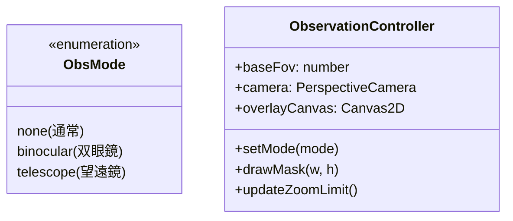
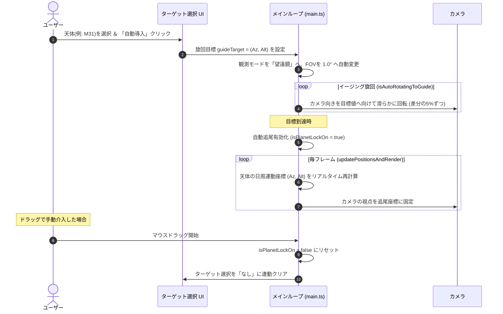

# Stellaris Planetarium - フロントエンド設計・実装仕様書 (Frontend Architecture Specification)

本ドキュメントは、**Stellaris Planetarium** のフロントエンドにおける 3D 天体レンダリングエンジン、WebWorker による並列計算システム、接眼レンズ（アイピース）シミュレーション、実写天体の投影・オクルージョン処理、および UI イベント制御の設計と実装について詳しく解説します。

---

## 1. 全体アーキテクチャとライフサイクル

フロントエンドは Vite, TypeScript, Three.js をベースに構築されています。レンダリングパフォーマンスを最大化（60fpsの維持）するため、描画処理と天体の位置計算処理を別々のスレッドに分離しています。

### 1.1 スレッド分離モデルとデータフロー

天体（5,000個以上の恒星および星座線）の地平座標（方位角・高度）および3D空間座標への変換処理は、メインスレッドで行うとフレームレートの低下を招きます。これを解決するため、バックグラウンドの WebWorker である [star-worker.ts](file:///c:/Users/nabe4/secret-tesst/front/src/star-worker.ts) に計算処理を完全にオフロードしています。

```mermaid
graph TD
    subgraph Main Thread [メインスレッド: main.ts]
        A[ユーザー操作 / 時間経過] --> B[updatePositionsAndRender]
        B --> C[postMessage: type 'update', LST, Latitude]
        G[updateStarSpritesFromBuffer] --> H[Three.js レンダリング]
        H --> I[Canvas 2D オーバーレイ描画]
    end

    subgraph WebWorker [star-worker.ts]
        C --> D[受信: LST/緯度]
        D --> E[星・星座座標の並列計算]
        E --> F[Float32Array バッファに格納]
        F --> G[postMessage: type 'result' ※ゼロコピー転送]
    end
end
```

- **初期化**: [main.ts](file:///c:/Users/nabe4/secret-tesst/front/src/main.ts) の [initWorker()](file:///c:/Users/nabe4/secret-tesst/front/src/main.ts#L628) で Worker を生成し、[syncStarsToWorker()](file:///c:/Users/nabe4/secret-tesst/front/src/main.ts#L733) を経由して星および星座のカタログデータを Worker へ転送・キャッシュさせます。
- **毎フレームの同期**:
  1. [tick()](file:///c:/Users/nabe4/secret-tesst/front/src/main.ts#L2973) ループ内で、メインスレッドから Worker に対して現在の「地方恒星時（LST）」と「観測緯度」を送信します。
  2. Worker 内で全天体の最新の地平座標を算出し、3D直交座標系 (X, Y, Z) に変換して共有バッファ（`Float32Array`）へ書き込みます。
  3. 座標バッファを `Transferable Objects` としてメインスレッドへゼロコピー転送します。
  4. メインスレッドの [updateStarSpritesFromBuffer()](file:///c:/Users/nabe4/secret-tesst/front/src/main.ts#L662) がバッファをパースし、各恒星スプライト（`THREE.Sprite`）および星座線（`THREE.LineSegments`）の頂点データをダイレクトに更新します。

### 1.2 ライフサイクルイベント

1. **ページロード**: DOM 構築後、API から観測可能天体データを取得。
2. **システム初期化**: [init3D()](file:///c:/Users/nabe4/secret-tesst/front/src/main.ts#L457) で Three.js シーン、ポストプロセッシング、地面、大気光等を生成。その後 [initWorker()](file:///c:/Users/nabe4/secret-tesst/front/src/main.ts#L628) と [initEvents()](file:///c:/Users/nabe4/secret-tesst/front/src/main.ts#L2296) を実行。
3. **描画ループ開始**: `requestAnimationFrame` による [tick()](file:///c:/Users/nabe4/secret-tesst/front/src/main.ts#L2973) の無限ループを開始。
4. **毎フレーム処理**: [updatePositionsAndRender()](file:///c:/Users/nabe4/secret-tesst/front/src/main.ts#L926) で、時間の進行、自動追尾（GoTo）計算、Worker とのデータ送受信、惑星・DSOの更新、およびレンダリング（WebGl + Canvas 2D Overlay）を行います。

---

## 2. 3D 描画コンポーネント (3D Rendering Components)

### 2.1 恒星の描画

- **スプライトシステム**: 5,000個以上の恒星は、個別に `THREE.Sprite` オブジェクトとして表現され、`starObjects` マップで管理されます。
- **テクスチャと色彩**: [createStarTexture()](file:///c:/Users/nabe4/secret-tesst/front/src/textures.ts#L5) は Canvas 上に動的な円形グラデーションテクスチャをプレジェネレートします。星の色温度（B-V色指数）に基づき、青白から赤までのリアルな色彩がマテリアルカラーにブレンドされます。
- **またたき (Twinkle) エフェクト**: レンダリング毎に、一等星などの明るい星（等級 < 3.0）に対し、星固有のインデックスと経過時間を用いたサイン波でスケールを微小に変動させ、夜空の「星の瞬き」を物理的に再現します。

### 2.2 プロシージャル山並みシルエット

地平線付近に立体感とリアリティを与えるため、プロシージャルに生成された山並みの3Dモデルを配置しています。

- **モデリング ([buildMountainSilhouette()](file:///c:/Users/nabe4/secret-tesst/front/src/main.ts#L343))**:
  - 異なる周波数と振幅を持つ 5 つのサイン波を重ね合わせる（合成ノイズ）ことで、自然でランダムなローポリゴンの山稜線を地平線沿いに構築します。
  - `THREE.BufferGeometry` で 3D メッシュ化され、側面には暗めのネオンブルー（`0x0f2d6b`）、山の輪郭（稜線）にはネオンシアン（`0x00ffcc`）のワイヤーフレームを重ね、サイバーパンク調の美しい外観を表現しています。
- **3D オクルージョン**:
  山並みは完全な黒（`0x000000`）かつ深度バッファへの書き込みを行う（`depthWrite: true`）ため、山の背後に沈み込む恒星、惑星、および天の川を物理的に遮蔽します。これにより、星空が山影に隠れるリアルな地平線オクルージョンが実現します。

### 2.3 天の川の再現 ([buildMilkyWay()](file:///c:/Users/nabe4/secret-tesst/front/src/main.ts#L275))

- 8,000 個の微細なパーティクルで構成された `THREE.Points` システムを使用しています。
- 銀河平面に沿ってパーティクルをランダム配置し、座標変換行列を用いて銀河座標系から赤道座標系に変換した上で天球の最奥（半径 900）に配置されます。

### 2.4 大気散乱シミュレーション

- 地平線付近に 2 つのトーラスメッシュ（大気散乱リング）を配置し、高度が低くなるほど光が散乱して青く光る「大気光グロー」を表現しています。
- 時間の経過とともに大気の不透明度（`opacity`）を呼吸するように緩やかに波打たせる「パルスアニメーション」を適用し、画面に有機的な動きを与えています。

---

## 3. 観測モード & レチクル (Observation Modes)

天体観測体験を再現するため、「通常モード」に加え、視野角 (FOV) が制限された「双眼鏡モード」「望遠鏡モード」を搭載しています。



### 3.1 視野角 (FOV) とズーム制限の制御

[main.ts](file:///c:/Users/nabe4/secret-tesst/front/src/main.ts) では、選択された観測モードに応じてカメラの視野角（ズーム範囲）を厳密にクリップします。

| 観測モード | 基準視野角 (FOV) | ズーム可能範囲 (FOV) | 特徴 |
|---|---|---|---|
| **通常モード** (`none`) | 85.0° | 20.0° 〜 110.0° | 広角視野、マウスドラッグによる自由旋回 |
| **双眼鏡モード** (`binocular`) | 7.5° | 4.0° 〜 15.0° | 実視野約7.5度の双眼鏡見え味のシミュレート |
| **望遠鏡モード** (`telescope`) | 1.0° | 0.2° 〜 4.0° | 高倍率アイピース、イルミネーテッド・レチクル表示 |

### 3.2 2D Canvas オーバーレイマスク ([drawObservationMask()](file:///c:/Users/nabe4/secret-tesst/front/src/main.ts#L1882))

WebGL レンダラーの上に重ねられた 2D Canvas を用いて、アイピース（接眼レンズ）の視野円を物理的にクリッピングします。

1. 画面中央を原点とし、画面の短い方の辺の 82% を直径とする円形の透過領域を描画します。
2. 円の境界外側を暗黒 (`rgba(2, 3, 10, 0.98)`) で塗りつぶし、円の境界には 20px 幅で滑らかな透過度グラデーション（ケラレ）を適用して、リアリティのある覗き窓を表現します。
3. **イルミネーテッド・レチクル (望遠鏡モードのみ)**:
   赤色（暗視野照明をシミュレートした `#ff3333`）の極細線を用いて、中央の十字線、3つの同心円、および十字線上の等間隔目盛りを描画します。これにより、天体写真や天体観測で用いられるガイドアイピースの視野を再現します。

---

## 4. 実写天体写真の3D投影とオクルージョン (Astrophotography & Occlusion)

### 4.1 天球座標への3D配置とロード ([buildDsoPhotos()](file:///c:/Users/nabe4/secret-tesst/front/src/main.ts#L2082))

月、主要惑星、および20以上のDSOアセットを `THREE.TextureLoader` でロードし、`THREE.Sprite` に貼り付けて 3D 空間上の実座標 (RA, Dec) に配置します。これにより、日周運動に伴う天球の回転や、カメラの旋回に完全に同期して写真アセットが移動します。

### 4.2 動的な不透明度フェードイン

広角（ズームアウト）表示の際に実写写真が不自然に浮き出るのを防ぐため、カメラの視野角（FOV）が狭くなる（ズームインする）のに連動して不透明度（`opacity`）を滑らかにフェードインさせます。

$$\text{opacity} = \max\left(0.0, \min\left(1.0, \frac{15.0 - \text{camera.fov}}{10.0}\right)\right)$$

### 4.3 星空とメタデータの遮蔽 (Occlusion Logic)

望遠鏡で天体をクローズアップした際の見やすさを高めるため、以下の遮蔽処理を毎フレーム実行します（[updateDsoPhotos()](file:///c:/Users/nabe4/secret-tesst/front/src/main.ts#L2134)）。

- **背景星の非表示**: ターゲット天体の中心座標から角距離が **2.2度以内** にある背景恒星を一時的に非表示（`visible = false`）にします。これにより、実写写真の裏側から恒星が透けてごちゃつく現象を防ぎます。
- **2Dマーク・ラベルのオクルージョン**: ターゲットに指定されている天体の 2D Canvas によるマーク枠や名称テキストは、二重描画を避けるために描画をスキップします。
- **ブレンド処理**: スプライトには通常ブレンド（`THREE.NormalBlending`）を適用します。実写アセット画像の外周暗黒部が、背後の天の川や他の恒星、星座線を完全に遮蔽し、暗黒の宇宙空間に目的の天体だけがクリアに浮かび上がるように制御されます。

---

## 5. インタラクション & 自動導入・追尾システム

### 5.1 マウス・タッチ操作

- **旋回ドラッグ**: ドラッグ（またはマルチタッチスワイプ）量に応じて、視野の方位角（`viewAzimuth`：0〜360度）と高度（`viewAltitude`：地平線付近の0度〜天頂の90度）を連続的に変化させます。高度は極点付近での反転を防ぐため、1°〜89.9°に制限されます。
- **ホイールズーム**: マウスホイール（またはピンチ操作）によりカメラの FOV を動的に拡大縮小します。前述した観測モードごとの限界値でクリップされます。

### 5.2 自動導入 (GoTo) と自動追尾 (Lock-On)

観測対象の自動導入と日周運動への追尾は、天体望遠鏡のコンピュータ赤道儀システムをエミュレートしています。



- **自動旋回**: 目標天体が決定されると、[isAutoRotatingToGuide](file:///c:/Users/nabe4/secret-tesst/front/src/main.ts#L121) が有効になり、毎フレーム差分の 5% ずつ目標方位角・高度へ滑らかにイージングしながらカメラが旋回します。
- **自動追尾**: 旋回完了後、[isPlanetLockOn](file:///c:/Users/nabe4/secret-tesst/front/src/main.ts#L56) を有効にします。天体は地球の自転に伴って西へ動いていく（日周運動）ため、毎フレームその時刻における天体の最新の地平座標を再計算し、カメラの `lookAt` を補正し続けることで視野中央にロックし続けます。
- **手動介入によるリセット**: 自動追尾中にユーザーが画面をドラッグ、あるいはスワイプすると、観察の主導権をユーザーに戻すため、自動追尾フラグとターゲット選択状態が自動的かつ安全に解除されます。

---

## 6. 天文イベント & 流星群シミュレーション

### 6.1 日食・月食の判定と進行

- [updatePositionsAndRender()](file:///c:/Users/nabe4/secret-tesst/front/src/main.ts#L926) では、太陽と月の現在の角距離を算出し、角距離が 1.0 度未満の場合は日食として太陽の描画スケールや不透明度を減少させます。
- **イベント時の特別進行**: 特設の天文イベントが UI から選択されている場合（`activeCelestialEventKey`）、設定されたイベント開始・ピーク・終了時刻のタイムラインに基づき、食の深さ（`eclipseRatio`：0.0〜1.0）と進行フェーズ（`eclipsePhase`：0.0〜1.0）を線形補間し、月による太陽のオクルージョン（日食）や、地球の影による月の赤化（月食：ブラッドムーンエフェクト）の度合いを正確に制御します。

### 6.2 流星群シミュレーション ([updateMeteors()](file:///c:/Users/nabe4/secret-tesst/front/src/main.ts#L1970))

- ペルセウス座流星群や双子座流星群などの放射点（輻射点）座標から、ランダムなタイミングで周囲へ飛び出す流星パーティクルを生成します。
- 各流星は一定の速度で地平線方向へ移動し、大気との摩擦による発光と消滅をシミュレートしてフェードアウトします。
