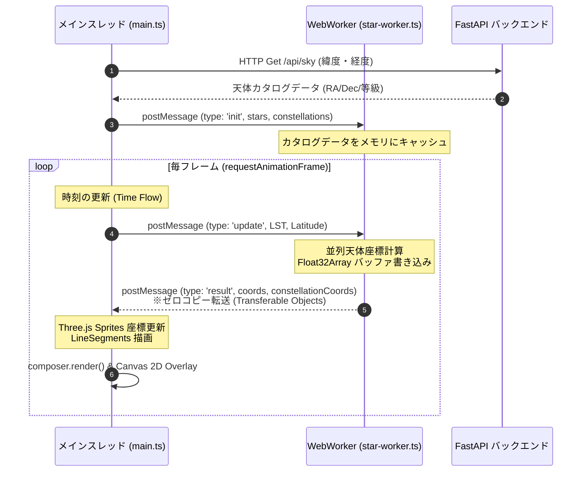

# Stellaris Planetarium - 詳細技術仕様書 (Technical Specification)

本ドキュメントは、**Stellaris Professional Interactive Planetarium** のコアシステムにおける天体計算アルゴリズム、スレッドアーキテクチャ、3D レンダリングパイプライン、および API 構造についての詳細な技術仕様を解説します。

---

## 1. 天体計算モデル (Astronomical Calculation)

本プロジェクトでは、外部の天文学ライブラリ（Astropy 等）に依存せず、Python バックエンドおよび WebWorker (TypeScript) 内で数式に基づいたフルスクラッチの天体計算を行います。

### 1.1 ユリウス日 (Julian Date: JD) の算出
時間経過に伴う天体位置の変化を連続的に扱うため、入力された UTC 時刻（グレゴリオ暦）をユリウス日へ変換します。

$$\text{JD} = \lfloor 365.25 \times (Y + 4716) \rfloor + \lfloor 30.6001 \times (M + 1) \rfloor + D + B - 1524.5$$

* **グレゴリオ暦補正因子 $B$**:
  $$A = \lfloor Y / 100 \rfloor$$
  $$B = 2 - A + \lfloor A / 4 \rfloor$$
* **注意点**: 1月および2月は前年の13月、14月として計算されます。

### 1.2 地方恒星時 (Local Sidereal Time: LST) の算出
観測地点の経度における天球の回転角を決定するため、平均グリニッジ恒星時 (GMST) を経由して LST を算出します（IAU 1982モデル準拠）。

1. J2000.0 からの経過ユリウス世紀数 $T$:
   $$T = \frac{\text{JD} - 2451545.0}{36525}$$
2. 平均グリニッジ恒星時 (GMST) の度数計算:
   $$\text{GMST (deg)} = 280.46061837 + 360.98564736629 \times (\text{JD} - 2451545.0) + 0.000387933 \times T^2 - \frac{T^3}{38710000.0}$$
3. 地方恒星時 (LST) への変換（観測経度 $\lambda$ 東経をプラスとする）:
   $$\text{LST (deg)} = (\text{GMST} + \lambda) \pmod{360}$$

### 1.3 赤道座標から地平座標への変換
恒星や天体のカタログ座標である赤経 ($\alpha$: RA, 時角換算)・赤緯 ($\delta$: Dec, 度数) を、観測地点における方位角 ($Az$)・高度 ($Alt$) に変換します。

1. **時角 (Hour Angle: HA)**:
   $$H = \text{LST} - (\alpha \times 15.0)$$
2. **高度 (Altitude: Alt)**:
   $$\sin(Alt) = \sin(\phi) \sin(\delta) + \cos(\phi) \cos(\delta) \cos(H)$$
   $$Alt = \arcsin(\sin(Alt))$$
   * $\phi$: 観測緯度 (Latitude)
3. **方位角 (Azimuth: Az)**:
   $$y = -\sin(H) \cos(\delta)$$
   $$x = \cos(\phi) \sin(\delta) - \sin(\phi) \cos(\delta) \cos(H)$$
   $$Az = \text{atan2}(y, x) \pmod{360}$$
   * 本システムの方位角定義は、**北を 0° とし、東を 90° (時計回り)** とします。

### 1.4 月の軌道計算と等級算出モデル (Moon Orbit & Magnitude)
月（Moon）は地球のすぐ近くを公転している地心天体であるため、他の惑星（日心座標から地心座標へ変換）とは異なり、地球を中心とした簡易軌道摂動モデルを用いて直接地心黄道座標を算出します。

1. **経過ユリウス世紀数 $T$ における平均軌道要素の計算**:
   - 平均経度 $L'$:
     $$L' = (218.3164477 + 481267.88123421 \times T) \pmod{360}$$
   - 太陽の平均近点角 $M$:
     $$M = (357.5291092 + 35999.0502909 \times T) \pmod{360}$$
   - 月の平均近点角 $M'$:
     $$M' = (134.9633964 + 477198.8675055 \times T) \pmod{360}$$
   - 平均緯度引数 $F$:
     $$F = (93.2720950 + 483202.0175233 \times T) \pmod{360}$$
   - 太陽と月の平均離角 $D$:
     $$D = (297.8501921 + 445267.1114034 \times T) \pmod{360}$$

2. **主要摂動を加味した月の黄経 $\lambda$ と黄緯 $\beta$**:
   $$\lambda = L' + 6.289 \sin(M') + 1.274 \sin(2D - M') + 0.658 \sin(2D) + 0.214 \sin(2M') - 0.186 \sin(M) - 0.114 \sin(2F)$$
   $$\beta = 5.128 \sin(F) + 0.280 \sin(M' + F) + 0.280 \sin(F - M') + 0.185 \sin(2D - F)$$

3. **月地球間距離 $d_{moon}$ (AU)**:
   $$d_{moon} = \frac{385001 - 20905 \cos(M') - 3699 \cos(2D - M')}{149597870.7}$$

4. **満ち欠け（輝面比）$k$ と見かけの等級 $mag$**:
   月の平均離角 $D$ から位相角の補角を求め、月が照らされている比率（輝面比 $k$）を算出します。
   $$k = \frac{1 + \cos(180^\circ - D)}{2}$$
   月齢に応じた光度変化をシミュレートするため、満月時（$k = 1$）で $-12.7$等、新月時で極めて暗くなる等級算出式を適用します。
   $$mag = -12.7 + 10.0 \times (1.0 - k)$$

---

## 2. スレッド・並列化アーキテクチャ (Multi-threading with WebWorker)

毎フレーム数千個の恒星および星座線セグメントを再計算してリアルタイムに天球を回転させるため、本プロジェクトではメインの UI レンダリングスレッドの負荷を極限まで低減させるマルチスレッド構造を採用しています。



### 2.1 ゼロコピーデータ転送 (Transferable Objects)
スレッド間での配列コピーのオーバーヘッドを避けるため、計算された座標データは `Transferable Objects` として転送されます。
* `coords`: 恒星の `[x, y, z, visible]` を格納する `Float32Array`。
* `constellationCoords`: 描画対象の星座線の始点・終点 `[x1, y1, z1, x2, y2, z2]` を格納する `Float32Array`。

スレッド間でメモリバッファの所有権を移動させる（ゼロコピー）ため、毎フレーム 5,000 個以上の天体計算を行ってもガベージコレクション (GC) やメモリコピーに伴うフレームドロップ (Stuttering) が一切発生せず、快適な **60fps** レンダリングを達成しています。

---

## 3. 3D グラフィックス & レンダリング技術 (3D Graphics & Visuals)

Three.js をベースに、リアルさとサイバーパンク的なネオン調の高級感を融合させた独自のヴィジュアルシステムを構築しています。

### 3.1 恒星の描画と輝き (UnrealBloomPass)
* **スプレッドテクスチャ**: 恒星は `THREE.Sprite` を用い、B-V色指数からマッピングされた色彩（青白〜白〜オレンジ〜赤）の動的なグラデーションテクスチャを Canvas 上でプレジェネレートして貼り付けています。
* **ポストプロセッシング**: `EffectComposer` による Bloom (光彩) 処理（`UnrealBloomPass`）を適用。カメラの視野角（FOV）に合わせて Bloom 強度と閾値を動的に変化させています。
  * **望遠（ズームイン）時**: 閾値 (threshold) を引き上げ、一等星などの非常に明るい星だけを強く拡散発光させ、コントラストを高めます。
  * **広角（ズームアウト）時**: 閾値を下げ、天の川を含めた全体に淡いグロー感をまとわせます。
* **またたき (Twinkle) 効果**: 等級が 3.0 未満の明るい星に対し、サイン波と星固有の ID を組み合わせた微細なまたたきアニメーションを適用しています。

### 3.2 プロシージャル山並みシルエットとオクルージョン
画面最前面に立体感を与えるため、プロシージャルに生成されたローポリゴンの山並みを地平線沿いに配置しています。

* **幾何構造の生成**: 異なる周波数と振幅を持つ 5 つのサイン波を重畳させ、自然な山稜の凹凸を生成し、`THREE.BufferGeometry` で地面へ伸びるクワッドメッシュを構築しています。
* **3D オクルージョン**: この山並みは完全な黒（`0x000000`）かつ `depthWrite: true` / `depthTest: true` で描画されるため、山並みの後ろに沈む星や天の川が物理的に遮蔽され、圧倒的なパララックス（視差効果）による奥行き感が表現されます。
* **ネオンアウトライン**: 山の輪郭には鮮烈なネオンシアン（`0x00ffcc`）、側面にはディープブルー（`0x0f2d6b`）のワイヤーフレームを重ね、SF的なデザインとして仕上げています。

### 3.3 天の川の再現 (Milky Way Particles)
銀河面に沿って 8,000 個のパーティクルを配置した `THREE.Points` システムです。
* 銀河座標系（銀緯 $b = 0^\circ$ 付近、銀経 $l = 0 \sim 360^\circ$）における分布を乱数で作成し、銀河北極（RA=192.86°, Dec=27.13°）を基準とする座標変換行列を用いて赤道座標系（RA, Dec）に変換。
* 天球の最奥レイヤー（半径 900）に配置することで、背景として自然な天の川を演出します。

### 3.4 大気散乱リング (Atmospheric Scattering Simulation)
地平線付近に 2 つのトーラスメッシュ（`THREE.TorusGeometry`）を配置し、大気による光の散乱（大気光）を再現しています。
* 時間経過とともに大気リングの不透明度（`opacity`）を呼吸するように波打たせる（パルスアニメーション）ことで、静的な画面に「生きた動き」を付与しています。

### 3.5 接眼レンズ（アイピース）視野円マスクとレチクル描画
天体観測ファン向けに、双眼鏡や天体望遠鏡的の接眼レンズから覗いた時の見え方を正確にシミュレートする 2D マスクオーバーレイシステムを構築しています。

* **視野円 (TFOV: True Field of View) の制御**:
  - **双眼鏡モード**: 一般的な 7x50 双眼鏡をシミュレートし、基準視野角を 7.5° に設定。ホイールによるズーム可能範囲を 4.0° 〜 15.0° に制限。
  - **望遠鏡モード**: 口径 200mm の反射望遠鏡をシミュレートし、基準視野角を 1.0° に設定。ズーム範囲を 0.2° 〜 4.0° に制限。
* **2D Canvas マスクグラデーション**:
  画面中央を原点とし、画面の短い方の辺の 82% を直径とする円形透過領域を作成。それ以外の外側を暗黒 (`rgba(2, 3, 10, 0.98)`) で塗りつぶすことで、星空やラベルを物理的にクリッピングします。円の境界には 20px 幅で滑らかなケラレグラデーションを施し、本物のアイピース枠の質感を再現します。
* **イルミネーテッド・レチクル (望遠鏡モードのみ)**:
  暗視野での観測を再現するため、ほのかに赤く輝く十字照準線、同心円（3段階）、および十字線上の等間隔目盛りを極細線で描画し、スケール感を演出します。

### 3.6 実写天体写真の3D投影と星空の遮蔽 (Astrophotography Overlay & Occlusion)
観測対象をズームアップした際、点や簡素なマークとして表示される天体を、実際の宇宙望遠鏡や天体写真で撮影された「実際の天体画像（月、主要惑星、DSO）」に置き換えて描画します。

* **天球座標への3D配置**:
  - 各アセット写真（月、木星、土星、金星、火星、M31、M42、M45）を `THREE.Texture` としてロードし、`THREE.Sprite` に貼り付けて 3D 空間上の実座標 (RA, Dec) に配置します。
  - これにより、カメラのドラッグ回転や日周運動（天球の回転）に完全に同期して写真が移動し、カメラのズーム（FOV）によって自然に拡大・縮小されます。
* **不透明度の動的フェードイン**:
  広角表示の際に実写写真が浮いてしまわないよう、カメラの視野角 $fov$ の縮小（ズームイン）に連動してフェードインする演出を施しています。
  $$\text{opacity} = \max\left(0.0, \min\left(1.0, \frac{15.0 - fov}{10.0}\right)\right)$$
* **星空と表示のオクルージョン（見やすさ向上）**:
  - **背景恒星の非表示**: ターゲット天体の中心座標 $(RA, Dec)$ から角距離が **2.2度以内** にある背景恒星を、毎フレームのバッファ適用時に非表示 (`visible = false`) にします。これにより写真の背後から余計な星が透け込んでごちゃつくのを防ぎます。
  - **DSO/惑星 2Dマークの非表示**: ターゲットに指定されている天体の 2D Canvas による枠線マークや名称ラベル、照準エフェクトは重複描画を避けるため描画をスキップします。
  - **通常ブレンド化**: 写真スプライトのマテリアルには `NormalBlending` を適用。写真自体の暗黒宇宙が背後の天の川や他の星空を完全に遮断し、望遠鏡視野内の天体像を極めてクリアに浮かび上がらせます。

### 3.7 自動導入 (GoTo) ＆ 自動追尾システム
手動で広大な星空から天体を探すストレスを無くすため、天体観測用コンピュータ赤道儀をシミュレートした「自動導入（GoTo）」および「自動追尾（ロックオン）」を実装しています。

* **自動導入シーケンス**:
  セレクトボックスからターゲットが選択されると、その天体の現在の地平座標 $(Az, Alt)$ をリアルタイムに計算し、カメラの旋回目標値 `guideTarget` に設定。自動回転（イージング）により、天体に向けて視野がスムーズに移動します。旋回開始と同時に、観測モードが「望遠鏡」へ、視野角が「1.0°」へ自動的に切り替わります。
* **自動追尾 (Lock-On)**:
  自動導入完了後、`isPlanetLockOn` 状態を有効化。天体の日周運動に合わせて毎フレームの地平座標を追跡し、カメラの向きを補正し続けることで、視野の中央に天体をロックします。
* **手動介入時のリセット連動**:
  自動追尾中にユーザーが手動で画面をドラッグ（またはスワイプ）した場合は、手動観察の意図を最優先するため、自動追尾フラグを自動的に解除し、ターゲット選択状態も安全に「ターゲットなし」へ連動リセットします。

---

## 4. API 仕様 (Backend Endpoints)

FastAPI で実装されたバックエンドは、精密計算用の天体データベースを提供します。

### 4.1 `GET /api/sky`
指定された観測地点と日時において観測可能な、すべての天体（恒星、星座線、惑星、DSO）の現在の地平座標・各種メタデータを一括して返します。

* **クエリパラメータ**:
  | パラメータ | 型 | デフォルト値 | 説明 |
  | :--- | :--- | :--- | :--- |
  | `lat` | float | `35.68` | 観測緯度（-90 ～ 90 度） |
  | `lng` | float | `139.76` | 観測経度（-180 ～ 180 度） |
  | `time` | string (ISO) | `None` | 観測日時。省略時はサーバーの現在時刻 (UTC) |
  | `mag_limit`| float | `6.0` | 描画する星の最大等級制限（暗い星のフィルタリング用） |

* **レスポンス (JSON概要)**:
  ```json
  {
    "datetime": "2026-06-14T05:00:00+00:00",
    "julian_date": 2461205.708333,
    "lst_deg": 185.3421,
    "stars": [
      {
        "id": 32349,
        "name_ja": "シリウス",
        "ra": 6.7525,
        "dec": -16.7161,
        "mag": -1.46,
        "bv": -0.03,
        "color": "#aabfff",
        "az": 210.4521,
        "alt": 12.3041
      }
    ],
    "constellation_lines": [
      {
        "cid": "CMa",
        "segments": [
          { "ra1": 6.75, "dec1": -16.7, "ra2": 6.97, "dec2": -24.0 }
        ]
      }
    ],
    "planets": [
      {
        "name": "Jupiter",
        "name_ja": "木星",
        "ra": 3.42,
        "dec": 18.5,
        "az": 85.12,
        "alt": 42.6,
        "color": "#ffedd5",
        "mag": -2.1,
        "dist_au": 5.2
      }
    ],
    "deep_sky_objects": [
      {
        "id": "M42",
        "name_ja": "オリオン大星雲",
        "name_en": "Orion Nebula",
        "type": "Emission Nebula",
        "size": 65,
        "mag": 4.0,
        "az": 225.1,
        "alt": 15.4
      }
    ]
  }
  ```

### 4.2 `GET /api/constellations`
全天 88 星座の解説や中心座標、見頃となる季節などのメタデータを取得します。

* **レスポンス (JSON概要)**:
  ```json
  {
    "constellations": {
      "Ori": {
        "name_ja": "オリオン座",
        "name_en": "Orion",
        "name_la": "Orion",
        "season": "冬",
        "desc": "天の赤道上に位置する、全天で最も華やかで有名な星座...",
        "center_ra": 5.5,
        "center_dec": 5.0,
        "rank": 1
      }
    }
  }
  ```

### 4.3 `GET /api/sky/stars-only`
初期ローディング時やアニメーション時のフレームレート維持などの目的で使用される、明るい星（デフォルトで 4 等星以下）のみを高速に取得するための軽量エンドポイントです。

---

## 5. 開発者向けトラブルシューティング

### 5.1 「Port already in use」による起動失敗
バックエンド（8000番ポート）またはフロントエンド（3000番ポート）の起動時に、過去のプロセスがゾンビプロセスとしてポートを占有し続けるケースがあります。

* **ポートの占有プロセスの特定と強制終了 (Windows PowerShell)**:
  ```powershell
  # 8000番ポートを占有しているPIDの調査
  netstat -ano | findstr 8000
  
  # 特定したPID（例: 12345）の強制終了
  taskkill /F /PID 12345
  ```
